# Workout Planner App: Entity Relationship Diagram

| | |
|---|---|
| **Document version** | 1.1 |
| **Date** | 18 September 2026 |
| **Status** | Verified against DESIGN 0.6 §4.3, cross-checked against SRS 1.3 §4 |
| **Describes** | `docs/DESIGN.md` §4.3 DDL (22 tables, 46 foreign keys) |
| **Location** | `docs/ERD.md` |

This diagram is the visual companion to the DDL in `DESIGN.md` §4.3, and `DESIGN.md` §4.2 links here in place of its old ASCII sketch. The DDL remains the reviewed reference and `src/data/schema.ts` remains the code source of truth; if they disagree with this document, they win.

---

## 1. Diagram

```mermaid
erDiagram
    %% ───────────── Library ─────────────
    skill {
        TEXT id PK
        TEXT name
        TEXT muscle_group "MuscleGroup enum"
        TEXT secondary_muscles "JSON array"
        TEXT equipment "Equipment enum"
        TEXT tracking_type "weight_reps|reps_only|bodyweight_plus_load|time|completion_only"
        TEXT load_convention "total|per_side"
        INTEGER is_unilateral
        INTEGER is_main_lift "FR-1.9 requires weight_reps + total"
        INTEGER is_custom
        INTEGER is_archived
    }

    %% ───────────── Templates and plans ─────────────
    template {
        TEXT id PK
        TEXT name
        REAL default_tm_percent
        INTEGER sessions_per_week
        TEXT level "beginner|intermediate"
        INTEGER is_built_in
    }
    plan {
        TEXT id PK
        TEXT source_template_id FK "nullable, SET NULL"
        TEXT name
        TEXT status "draft|active|paused|completed|abandoned"
        TEXT start_date "local date"
        REAL default_tm_percent
        TEXT paused_on "v1.1"
        TEXT ended_at
    }
    plan_skill {
        TEXT id PK
        TEXT plan_id FK
        TEXT skill_id FK
        REAL tm_percent "null = plan default"
        REAL starting_one_rm_kg
    }

    %% ───────────── Blueprint, shared by templates and plans ─────────────
    phase {
        TEXT id PK
        TEXT template_id FK "XOR plan_id"
        TEXT plan_id FK "XOR template_id"
        TEXT generated_from_phase_id FK "generated deloads"
        TEXT continues_phase_id FK "D-1, D-14"
        INTEGER continues_offset_weeks
        INTEGER sort_order
        TEXT type "training|deload|taper"
        TEXT review_mode "every_cycle|end_of_phase|none"
        INTEGER length_weeks
        INTEGER cycle_length_weeks
        REAL volume_factor
        REAL load_factor
        REAL rpe_cap
        INTEGER rest_days_at_end
        INTEGER has_test_day "taper only"
        TEXT default_increase_type "estimated|percent|fixed|none"
    }
    increase_rule {
        TEXT id PK
        TEXT phase_id FK
        TEXT skill_id FK
        TEXT increase_type "estimated|percent|fixed|none"
        REAL increase_value
        TEXT fallback_type
    }
    cycle_workout {
        TEXT id PK
        TEXT phase_id FK
        TEXT name
        INTEGER sort_order
        TEXT kind "normal|test_day"
    }
    cycle_slot {
        TEXT id PK
        TEXT phase_id FK
        TEXT cycle_workout_id FK
        INTEGER cycle_week_index
        INTEGER weekday "0-6"
        INTEGER sort_order
        INTEGER retired_from_group_week "C-5"
    }
    cycle_exercise {
        TEXT id PK
        TEXT cycle_workout_id FK
        TEXT skill_id FK
        TEXT source_cycle_exercise_id FK "deload/taper copies"
        INTEGER sort_order
        TEXT superset_group
        INTEGER rest_sec
    }
    cycle_set {
        TEXT id PK
        TEXT cycle_exercise_id FK
        INTEGER set_index
        INTEGER is_warmup
        INTEGER is_amrap
        INTEGER reps_min
        INTEGER reps_max
        REAL target_rpe_min
        REAL target_rpe_max
        TEXT load_type "percent_tm|double_progression|fixed|bodyweight|top_set"
        REAL load_percent "top_set: starting % of TM"
        REAL fixed_load_kg
        INTEGER target_time_sec
    }

    %% ───────────── Generated schedule ─────────────
    planned_workout {
        TEXT id PK
        TEXT plan_id FK
        TEXT phase_id FK
        TEXT cycle_group_id FK "phase.id, D-14"
        TEXT cycle_workout_id FK
        TEXT cycle_slot_id FK "D-20, null for Test Day"
        TEXT session_id FK "nullable, SET NULL"
        INTEGER phase_cycle_index
        INTEGER week_index
        TEXT scheduled_date "local date"
        TEXT status "upcoming|completed|skipped; missed is derived"
    }
    double_progression_state {
        TEXT cycle_exercise_id PK "also FK"
        TEXT plan_id FK
        TEXT last_increase_session_id FK "nullable, SET NULL"
        REAL working_load_kg
        REAL previous_working_load_kg
        TEXT last_reps "JSON, D-12"
        INTEGER consecutive_below_min
    }
    schedule_change {
        TEXT id PK
        TEXT plan_id FK
        TEXT from_planned_workout_id FK "nullable, SET NULL"
        TEXT type "shift|move|repin|pause|length|insert_deload"
        INTEGER from_week_index
        INTEGER offset_days
        TEXT payload "JSON, §4.5"
        TEXT undone_at
    }

    %% ───────────── Reviews and 1RM ─────────────
    cycle_review {
        TEXT id PK
        TEXT plan_id FK
        TEXT cycle_group_id FK "phase.id, null for final"
        TEXT kind "cycle|final"
        INTEGER phase_cycle_index
        TEXT status "pending|completed"
        INTEGER sessions_completed
        INTEGER sessions_planned
    }
    cycle_review_item {
        TEXT id PK
        TEXT cycle_review_id FK
        TEXT skill_id FK
        TEXT source_set_log_id FK "nullable, SET NULL"
        REAL previous_one_rm_kg
        REAL suggested_one_rm_kg
        REAL reference_e1rm_kg
        TEXT suggestion_source "estimated|test_day|percent|fixed|none"
        INTEGER is_fallback
        REAL confirmed_one_rm_kg
        TEXT decision "accepted|edited|kept"
    }
    one_rep_max_history {
        TEXT id PK
        TEXT skill_id FK
        TEXT plan_id FK "nullable, SET NULL"
        TEXT cycle_review_id FK "nullable, SET NULL"
        TEXT estimate_session_id FK "nullable, SET NULL"
        REAL one_rm_kg
        TEXT source "plan_setup|setup_estimate|cycle_review|manual"
        INTEGER effective_from_week_index "derived, D-2"
        TEXT set_at
    }

    %% ───────────── Logging ─────────────
    session {
        TEXT id PK
        TEXT plan_id FK "nullable, SET NULL"
        TEXT planned_workout_id FK "nullable, SET NULL"
        TEXT phase_id FK "nullable, SET NULL"
        TEXT cycle_group_id "no FK, see §4"
        INTEGER phase_cycle_index
        TEXT name "snapshot"
        TEXT kind "planned|ad_hoc|one_rm_estimate|test_day"
        TEXT local_date
        TEXT status "in_progress|completed"
        REAL rpe
        REAL total_volume_kg "cached"
    }
    session_exercise {
        TEXT id PK
        TEXT session_id FK
        TEXT skill_id FK
        TEXT cycle_exercise_id FK "nullable, SET NULL"
        INTEGER sort_order
        INTEGER was_substituted
        INTEGER was_added
        REAL tm_snapshot_kg
        TEXT tracking_type "snapshot, D-16"
        TEXT load_convention "snapshot, D-16"
        INTEGER is_unilateral "snapshot"
        INTEGER is_main_lift "snapshot"
        REAL dp_increase_kg
    }
    set_log {
        TEXT id PK
        TEXT session_exercise_id FK
        INTEGER set_index
        INTEGER is_warmup
        INTEGER is_amrap
        INTEGER is_top_set "D-19"
        INTEGER prescribed_reps_min
        INTEGER prescribed_reps_max
        REAL prescribed_load_kg "snapshot"
        REAL target_rpe_max
        INTEGER reps
        REAL load_kg
        INTEGER time_sec
        REAL rpe "6-10, half points"
        TEXT status "pending|completed|failed"
    }
    personal_record {
        TEXT id PK
        TEXT skill_id FK
        TEXT session_id FK "nullable, CASCADE"
        TEXT set_log_id FK "nullable, CASCADE"
        TEXT type "heaviest|e1rm|reps_at_weight|max_reps|heaviest_added|reps_at_added|longest_time"
        REAL value
        REAL context_weight_kg
        TEXT achieved_at
        INTEGER is_manual
    }

    %% ───────────── Standalone ─────────────
    settings {
        INTEGER id PK "always 1"
        TEXT unit "kg|lb"
        INTEGER week_start "0 Sun, 1 Mon"
        INTEGER default_rest_sec
        TEXT theme
        TEXT disclaimer_ack_at
        TEXT last_export_at
    }
    app_meta {
        TEXT key PK "schema_version, seed_version"
        TEXT value
    }

    %% ───────────── Relationships ─────────────
    skill ||--o{ plan_skill : "is trained in"
    skill ||--o{ increase_rule : "overridden by"
    skill ||--o{ cycle_exercise : "prescribed as"
    skill ||--o{ session_exercise : "logged as"
    skill ||--o{ cycle_review_item : "reviewed in"
    skill ||--o{ one_rep_max_history : "has 1RM history"
    skill ||--o{ personal_record : "holds"

    template |o--o{ phase : "blueprint of (XOR plan)"
    template |o--o{ plan : "deep-copied into"

    plan ||--o{ plan_skill : "configures"
    plan |o--o{ phase : "blueprint of (XOR template)"
    plan ||--o{ planned_workout : "schedules"
    plan ||--o{ double_progression_state : "tracks"
    plan ||--o{ cycle_review : "raises"
    plan ||--o{ schedule_change : "records"
    plan |o--o{ one_rep_max_history : "sets 1RMs during"
    plan |o--o{ session : "contains"

    phase ||--o{ increase_rule : "overrides with"
    phase ||--o{ cycle_workout : "defines once (D-20)"
    phase ||--o{ cycle_slot : "places on weekdays"
    phase ||--o{ planned_workout : "generates"
    phase ||--o{ planned_workout : "cycle group of"
    phase |o--o{ cycle_review : "cycle group of"
    phase |o--o{ session : "logged under"
    phase |o--o{ phase : "generated deload from"
    phase |o--o{ phase : "continued by"

    cycle_workout ||--o{ cycle_exercise : "contains"
    cycle_workout ||--o{ planned_workout : "instantiated as"
    cycle_workout ||--o{ cycle_slot : "appears in"
    cycle_slot |o--o{ planned_workout : "generates"
    cycle_exercise ||--o{ cycle_set : "prescribes"
    cycle_exercise |o--o{ cycle_exercise : "copied into deload as"
    cycle_exercise ||--o| double_progression_state : "has state"
    cycle_exercise |o--o{ session_exercise : "logged as"

    planned_workout |o--o| session : "logged as"
    planned_workout |o--o{ schedule_change : "moved by"

    session ||--o{ session_exercise : "contains"
    session |o--o{ personal_record : "sets"
    session |o--o{ one_rep_max_history : "estimates 1RM in"
    session |o--o{ double_progression_state : "last increased by"

    session_exercise ||--o{ set_log : "contains"
    set_log |o--o{ personal_record : "achieves"
    set_log |o--o{ cycle_review_item : "evidence for"

    cycle_review ||--o{ cycle_review_item : "contains"
    cycle_review |o--o{ one_rep_max_history : "confirms"
```

`settings` and `app_meta` have no relationships: `settings` is a single row (`CHECK (id = 1)`) and `app_meta` is a key/value store.

---

## 2. Reading the diagram

**Blueprint sharing.** `phase`, `cycle_workout`, `cycle_exercise` and `cycle_set` are shared by templates and plans (§4.1). Ownership is the XOR on `phase`: `CHECK ((template_id IS NULL) <> (plan_id IS NULL))`. Everything below `phase` inherits its owner, so there is no template/plan column on the lower three tables. Starting a plan (FR-2.3) and saving a template (FR-2.8) are deep copies with new IDs, which is why the same four tables appear once rather than twice.

**Two edges from `phase` to `planned_workout`.** `phase_id` is the phase a workout was generated from; `cycle_group_id` is `continues_phase_id ?? phase.id`, the key cycle numbers and reviews hang off (D-14). For a continuation phase the two differ, and `cycle_review.cycle_group_id` always points at the *original* phase.

**Two self-references on `phase`.** `generated_from_phase_id` marks a generated deload (SET NULL on delete, so the deload survives its source); `continues_phase_id` marks a continuation (CASCADE, so a continuation cannot outlive its original).

**The `planned_workout` ↔ `session` pair.** Both sides hold a nullable FK to the other and both are SET NULL on delete. Logically 1:0..1 in each direction: an ad-hoc session has no planned workout, an upcoming or skipped workout has no session. Neither column is unique, so the 1:1 is a service invariant, not a DB one.

**Snapshots are not relationships.** `session_exercise.tracking_type`, `load_convention`, `is_unilateral`, `is_main_lift` and `tm_snapshot_kg`, and `set_log.prescribed_*`, are copied values (D-16, FR-1.10). The FK to `skill` and `cycle_exercise` is for grouping and history, not for reading current values.

---

## 3. Relationships, cardinality and delete behaviour

Generated from the DDL: 46 foreign keys over 22 tables. "1" on the parent side means the FK column is `NOT NULL`.

| Parent | Child | FK column | Cardinality | On delete |
|---|---|---|---|---|
| `cycle_exercise` | `cycle_exercise` | `source_cycle_exercise_id` | 0..1 → 0..N | SET NULL |
| `cycle_exercise` | `cycle_set` | `cycle_exercise_id` | 1 → 0..N | CASCADE |
| `cycle_exercise` | `double_progression_state` | `cycle_exercise_id` [^f1] | 1 → 0..1 | CASCADE |
| `cycle_exercise` | `session_exercise` | `cycle_exercise_id` | 0..1 → 0..N | SET NULL |
| `cycle_review` | `cycle_review_item` | `cycle_review_id` | 1 → 0..N | CASCADE |
| `cycle_review` | `one_rep_max_history` | `cycle_review_id` | 0..1 → 0..N | SET NULL |
| `cycle_slot` | `planned_workout` | `cycle_slot_id` [^f4] | 0..1 → 0..N | NO ACTION |
| `cycle_workout` | `cycle_exercise` | `cycle_workout_id` | 1 → 0..N | CASCADE |
| `cycle_workout` | `cycle_slot` | `cycle_workout_id` | 1 → 0..N | CASCADE |
| `cycle_workout` | `planned_workout` | `cycle_workout_id` [^f4] | 1 → 0..N | NO ACTION |
| `phase` | `cycle_review` | `cycle_group_id` [^f2] | 0..1 → 0..N | CASCADE |
| `phase` | `cycle_slot` | `phase_id` | 1 → 0..N | CASCADE |
| `phase` | `cycle_workout` | `phase_id` | 1 → 0..N | CASCADE |
| `phase` | `increase_rule` | `phase_id` | 1 → 0..N | CASCADE |
| `phase` | `phase` | `continues_phase_id` | 0..1 → 0..N | CASCADE |
| `phase` | `phase` | `generated_from_phase_id` | 0..1 → 0..N | SET NULL |
| `phase` | `planned_workout` | `cycle_group_id` | 1 → 0..N | CASCADE |
| `phase` | `planned_workout` | `phase_id` | 1 → 0..N | CASCADE |
| `phase` | `session` | `phase_id` | 0..1 → 0..N | SET NULL |
| `plan` | `cycle_review` | `plan_id` | 1 → 0..N | CASCADE |
| `plan` | `double_progression_state` | `plan_id` | 1 → 0..N | CASCADE |
| `planned_workout` | `schedule_change` | `from_planned_workout_id` | 0..1 → 0..N | SET NULL |
| `planned_workout` | `session` | `planned_workout_id` [^f3] | 0..1 → 0..N | SET NULL |
| `plan` | `one_rep_max_history` | `plan_id` | 0..1 → 0..N | SET NULL |
| `plan` | `phase` | `plan_id` | 0..1 → 0..N | CASCADE |
| `plan` | `plan_skill` | `plan_id` | 1 → 0..N | CASCADE |
| `plan` | `planned_workout` | `plan_id` | 1 → 0..N | CASCADE |
| `plan` | `schedule_change` | `plan_id` | 1 → 0..N | CASCADE |
| `plan` | `session` | `plan_id` | 0..1 → 0..N | SET NULL |
| `session_exercise` | `set_log` | `session_exercise_id` | 1 → 0..N | CASCADE |
| `session` | `double_progression_state` | `last_increase_session_id` | 0..1 → 0..N | SET NULL |
| `session` | `one_rep_max_history` | `estimate_session_id` | 0..1 → 0..N | SET NULL |
| `session` | `personal_record` | `session_id` | 0..1 → 0..N | CASCADE |
| `session` | `planned_workout` | `session_id` [^f3] | 0..1 → 0..N | SET NULL |
| `session` | `session_exercise` | `session_id` | 1 → 0..N | CASCADE |
| `set_log` | `cycle_review_item` | `source_set_log_id` | 0..1 → 0..N | SET NULL |
| `set_log` | `personal_record` | `set_log_id` | 0..1 → 0..N | CASCADE |
| `skill` | `cycle_exercise` | `skill_id` | 1 → 0..N | NO ACTION |
| `skill` | `cycle_review_item` | `skill_id` | 1 → 0..N | NO ACTION |
| `skill` | `increase_rule` | `skill_id` | 1 → 0..N | NO ACTION |
| `skill` | `one_rep_max_history` | `skill_id` | 1 → 0..N | NO ACTION |
| `skill` | `personal_record` | `skill_id` | 1 → 0..N | NO ACTION |
| `skill` | `plan_skill` | `skill_id` | 1 → 0..N | NO ACTION |
| `skill` | `session_exercise` | `skill_id` | 1 → 0..N | NO ACTION |
| `template` | `phase` | `template_id` | 0..1 → 0..N | CASCADE |
| `template` | `plan` | `source_template_id` | 0..1 → 0..N | SET NULL |

[^f1]: The column is the table's primary key, so there is at most one state row per exercise. It is `NOT NULL` since D-27 (finding F-1).
[^f2]: `CASCADE` since DESIGN 0.5 (C-16): deleting a phase deletes its reviews. Finding F-2 is resolved.
[^f3]: The two halves of the same 1:0..1 link. Neither column is unique, so the pairing is a service invariant.
[^f4]: Intentional restrict: slots and workouts are retired via `cycle_slot.retired_from_group_week`, never deleted once generated (C-5, D-20).

---

## 4. Verification

### 4.1 Method

1. The `sql` block of `DESIGN.md` §4.3 was extracted and run through SQLite 3.53 (`better-sqlite3`) with `PRAGMA foreign_keys = ON`. It executes cleanly: 22 tables, all indexes and all `CHECK` constraints are valid, and no primary key column accepts NULL.
2. Every relationship in the diagram was compared against `PRAGMA foreign_key_list` for each table (the §3 table is generated from it), in both directions, so the diagram has no edge the schema lacks and the schema has no FK the diagram misses.
3. A small fixture (one skill, template, plan, two phases with a continuation, blueprint, planned workout, session, sets, PR, review and 1RM row) was inserted and the delete and uniqueness rules from SRS §4 and DESIGN §4.4 were exercised against it. This fixture run was done against DESIGN 0.4. From build-plan step 5 it is automated: `src/data/constraints.test.ts` runs every row below against the migrated schema, and `src/data/schema.test.ts` checks that the migration matches §4.3.

### 4.2 Results

| Check | Expected | Result |
|---|---|---|
| Diagram edges ↔ schema FKs | exact match | 46/46 ✓ |
| Entities ↔ tables | exact match | 22/22 ✓ |
| No NULL primary keys (D-27) | none nullable | 21/21 TEXT keys `NOT NULL` ✓ |
| Delete a plan: sessions, PRs and 1RM history survive, `plan_id` nulled (SRS §4) | kept | ✓ |
| Delete a plan: phases, planned workouts, reviews, DP state, schedule changes go | cascaded | ✓ |
| Delete a session: `session_exercise`, `set_log`, `personal_record` go | cascaded | ✓ |
| Delete a session: `planned_workout.session_id` and `double_progression_state.last_increase_session_id` nulled | nulled | ✓ |
| Delete a template: plan keeps its copied phases, `source_template_id` nulled | kept | ✓ |
| At most one `active` or `paused` plan (FR-4.1) | rejected | ✓ |
| At most one `in_progress` session (§8.2) | rejected | ✓ |
| At most one `final` review per plan (D-5) | rejected | ✓ |
| Phase owned by exactly one of template/plan | both and neither rejected | ✓ |
| `top_set` needs `load_percent`, target RPE, `reps_max ≤ 5`, not AMRAP, not warm-up (D-19) | rejected | ✓ |
| Deload/taper phase forced to a 1-week cycle (C-1) | rejected | ✓ |
| `has_test_day` only on a taper (FR-2.14) | rejected | ✓ |
| Delete a `cycle_workout` with generated planned workouts | blocked | ✓ by design (C-5 retires rather than deletes) |
| Delete a phase: its cycle reviews go (C-16) | cascaded | added in 0.5 |

### 4.3 Findings

Version 1.0 of this document raised three findings against DESIGN 0.4. All three are now closed.

**F-1 — TEXT primary keys were nullable. Fixed in DESIGN 0.6 (D-27).** SQLite does not imply `NOT NULL` for a non-`INTEGER PRIMARY KEY`, and `UNIQUE` treats NULLs as distinct, so every TEXT-keyed table accepted any number of rows with a NULL key. That included `double_progression_state`, whose 1:0..1 edge to `cycle_exercise` was therefore unenforced. All 21 are now `TEXT PRIMARY KEY NOT NULL`, and §4.1 states the convention.

**F-2 — deleting a phase was blocked by its cycle reviews. Resolved in DESIGN 0.5 (C-16).** `cycle_review.cycle_group_id` is now `ON DELETE CASCADE`, so `deletePhase` (FR-2.11) works when a skipped or missed cycle has left a review behind.

**F-3 — `session.cycle_group_id` has no foreign key. Documented in DESIGN 0.6 (§4.4, D-27).** This is deliberate: session history must outlive its plan. The value is a historical label, meaningless once `session.phase_id` is null, and nothing may join through it after that.

### 4.4 Consistency with SRS §4

The repo states the schema twice: the logical model in `REQUIREMENTS.md` §4 and the DDL in `DESIGN.md` §4.3. The DDL is the reviewed reference and `src/data/schema.ts` is the code source of truth (§4.1). Comparing the logical model against the DDL, field by field:

**Every logical entity exists.** All 24 entities in SRS §4 map onto the 22 tables — `TemplatePhase`/`PlanPhase` onto `phase`, `TemplateWorkout`/`CycleWorkout` onto `cycle_workout`, and so on down the blueprint, which is the sharing described in §4.1. `app_meta` is the only table with no logical counterpart. No logical field is missing from the DDL.

**Six names drift between the documents.** Harmless in isolation, but requirement text quoting the SRS name will not grep. `schema.ts` follows the DDL (§4.1):

| SRS §4 | DDL §4.3 | Note |
|---|---|---|
| `defaultIncrementType`, `defaultIncrementValue`, `fallbackIncrementType`, `fallbackIncrementValue`, `incrementType`, `incrementValue` | `default_increase_type`, `default_increase_value`, `fallback_increase_type`, `fallback_increase_value`, `increase_type`, `increase_value` | **increment** vs **increase**, across 8 columns on `phase` and `increase_rule`. The rest of both documents says "increase". |
| `secondaryMuscleGroups` | `secondary_muscles` | |
| `sourceExerciseId` | `source_cycle_exercise_id` | |
| `disclaimerAcknowledgedAt` | `disclaimer_ack_at` | |
| `prescribedReps` | `prescribed_reps_min`, `prescribed_reps_max` | Deliberate split: a prescription is a range (FR-3.15). |
| `targetRpe` | `target_rpe_min`, `target_rpe_max` | Same. |

**The DDL adds about 25 columns the logical model doesn't have.** SRS §4 allows this ("fields are indicative"), and most are plainly physical: `updated_at`, `summary`, `key`. Four carry rules that aren't in the SRS at all and are worth promoting at its next revision, the same way §1.3 clarifications are:

- `session.kind` (`planned|ad_hoc|one_rm_estimate|test_day`) — the SRS model has no session kind, although FR-3.3a and FR-2.14 both need one.
- `session.local_date` — the date a session counts for in history, distinct from `started_at`. Decides which day a session near midnight belongs to; nothing in the SRS defines it.
- `template.sessions_per_week` is `NOT NULL` — so "save as template" (FR-2.8, v1.1) must derive it from the blueprint. Not mentioned anywhere.
- `increase_rule.increase_value_lb`, `phase.default_increase_value_lb`, `phase.fallback_increase_value_lb` — the lb twin of each fixed rule. FR-3.5 says fixed rules are per unit, but the logical model shows a single value, so it reads as though one column would do.

`cycle_slot.retired_from_group_week` is also absent from the SRS, but C-5 already covers it.

### 4.5 Also worth noting

- `uq_session_in_progress` is global, not per plan. That matches §8.2 ("reject if another session is in progress") and also blocks a second ad-hoc session, which is the intent.
- `personal_record.session_id` and `set_log_id` cascade, so deleting a session removes the PR rows outright rather than leaving orphans for the FR-10.5 replay to clean up. Correct, but it means PR replay has to recompute from the surviving sessions rather than repair rows in place.
